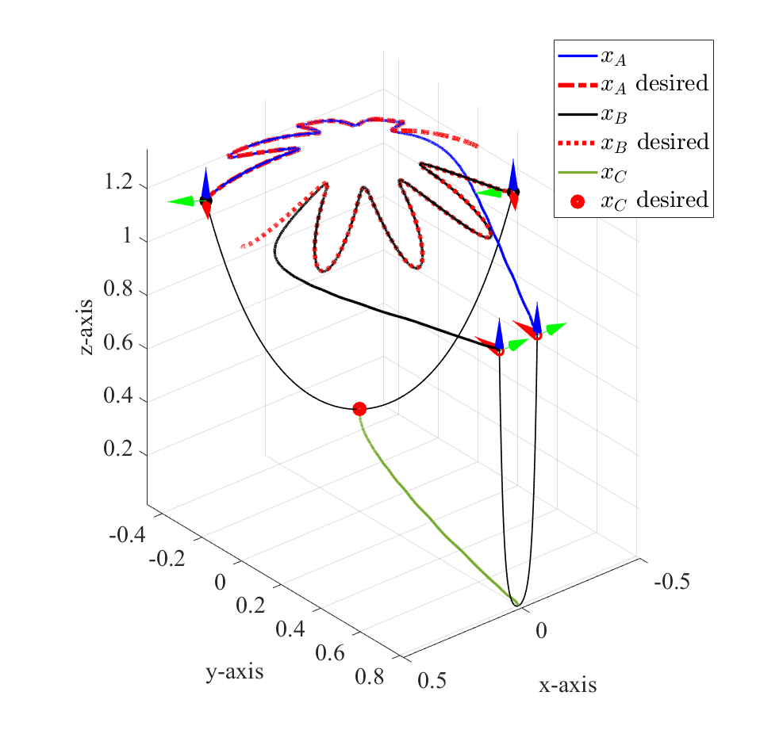

## Catenary robot MATLAB Simulator

### Installation

```
git clone _______________
cd Catenary_robot
git submodule init
git submodule update
```

### Citing this work


### Requirements

* MATLAB R2019a

### For running simulator 

* run ```main.m```




### Main loop


### Credits

This is an open source project, most of the code is licensed under GPL v3.0.

The simulator is currently developed and maintained by Lehigh University.

### Thank you 

Mr. Avinash Siravuru for his open source MATLAB Geometry-toolbox 
https://github.com/sir-avinash/geometry-toolbox
